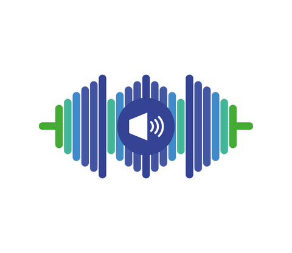

  

<h1 align="center"> Speech Recognition Dataset </h>

  
  

## Table of Contents

- [Overview](#overview)
- [Dataset](#dataset)
- [Integrated-development-environment](#integrated-development-environment)
- [Configuration](#configuration)